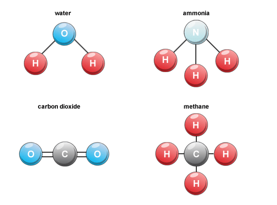

DeepChem教程06：图卷积（Graph Convolutions ）网络的介绍
==========================================================

欢迎来到DeepChem的介绍教程06——图卷积（Graph Convolutions ）网络的介绍。
我们将通过一系列的教程让你更全面的了解DeepChem工具，
从而帮助你更好的将深度学习技术应用到生命科学领域。
如果你是第一次接触这个工具，
建议先看 `入门教程1 <https://deepchembook.readthedocs.io/zh_CN/latest/examples/tutorials/01_start.html>`_。

在本教程中，我们将了解有关“图卷积（graph convolutions）”的更多信息。
这是处理分子数据的最强大的深度学习工具之一。 这样做的原因是分子可以自然地被视为Graph。 

请注意，我们从高中开始习惯的将分子和标准化学图关联在一起，如下图所示。

在本教程的其余部分，我们将更详细地深入研究这种关系。 这将使我们更深入地了解这些系统的工作原理。 

图卷积（Graph Convolutions ）网络
-----------------------------------------

.. contents:: 目录
    :local:

什么是图卷积网络？
^^^^^^^^^^^^^^^^^^^^^^^^^^^^^^^^^^^^
考虑一种常用于处理图像的标准卷积神经网络 (CNN)。 输入是像素网格。 
每个像素都有一个数据值向量，例如红色、绿色和蓝色通道。 
数据通过一系列卷积层。 每一层都将来自一个像素及其相邻像素的数据组合起来，为该像素生成一个新的数据向量。
早期层检测小尺度局部模式，而后期层检测更大、更抽象的模式。 
通常，卷积层与池化层交替进行，池化层在局部区域执行某些操作，例如最大值或最小值。

图卷积和其类似，但它们在图上操作。 它们以图中每个节点的数据向量开始（例如，该节点代表的原子的化学性质）。 
卷积层和池化层结合来自连接节点（例如，相互结合的原子）的信息，为每个节点生成一个新的数据向量。 

训练图卷积网络
^^^^^^^^^^^^^^^^^^^^^^^^^^^^^^^^^^^^

首先让我们加载 Tox21 数据集。 
我们将特征化器选项设置为“GraphConv”，以图卷积网络的方式对数据进行特征化。
:code:`dc.molnet.load_tox21` 函数返回任务（任务名称列表）、数据集（包含训练集、验证集和测试集）。
 和转换器（用于预处理数据集的数据转换列表）。 （大多数深度网络都非常挑剔，需要对数据进行转换来确保训练稳定进行。） 

.. code-block:: python 

    import deepchem as dc 

    tasks, datasets, transformers = dc.molnet.load_tox21(featurizer='GraphConv')
    train_dataset, valid_dataset, test_dataset = datasets

现在让我们在这个数据集上训练一个图卷积网络。
DeepChem 有一个 GraphConvModel 类，它封装了一个标准的图卷积架构，以方便用户使用。
让我们实例化这个类的一个对象并在我们的数据集上训练它。 

.. code-block:: python 

    n_tasks = len(tasks)
    model = dc.models.GraphConvModel(n_tasks, mode='classification')
    model.fit(train_dataset, nb_epoch=50)

让我们尝试评估我们训练的模型。 
为此，我们需要定义一个指标，即模型性能的衡量标准。 
:code:`dc.metrics` 已经内置了大量的指标。 
对于此数据集，衡量标准使用 ROC-AUC 分数，即接收者操作特征曲线下的面积（衡量精度和召回率之间的权衡）。 
幸运的是，ROC-AUC 也已经集成在 DeepChem 中了。

为了在这个指标下衡量模型的性能，我们可以调用:code:`model.evaluate()`函数对模型进行评价。 

.. code-block:: python 

    metric = dc.metrics.Metric(dc.metrics.roc_auc_score)
    print('Training set score:', model.evaluate(train_dataset, [metric], transformers))
    print('Test set score:', model.evaluate(test_dataset, [metric], transformers))

输出：

.. code-block:: console 

    Training set score: {'roc_auc_score': 0.9697383576717953}
    Test set score: {'roc_auc_score': 0.689795739440305}

如果GPU内存不够会影响模型的性能？

完整代码如下：

.. code-block:: console 

    import deepchem as dc 
    tasks, datasets, transformers = dc.molnet.load_tox21(featurizer='GraphConv')
    train_dataset, valid_dataset, test_dataset = datasets

    n_tasks = len(tasks)
    model = dc.models.GraphConvModel(n_tasks, mode='classification')
    model.fit(train_dataset, nb_epoch=50)

    metric = dc.metrics.Metric(dc.metrics.roc_auc_score)
    print('Training set score:', model.evaluate(train_dataset, [metric], transformers))
    print('Test set score:', model.evaluate(test_dataset, [metric], transformers))
